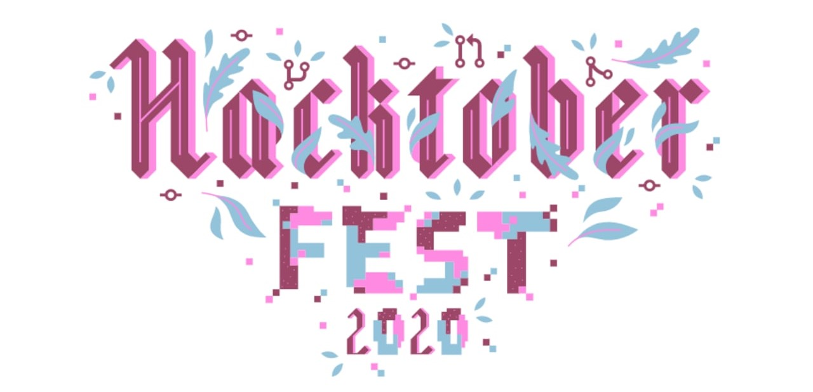
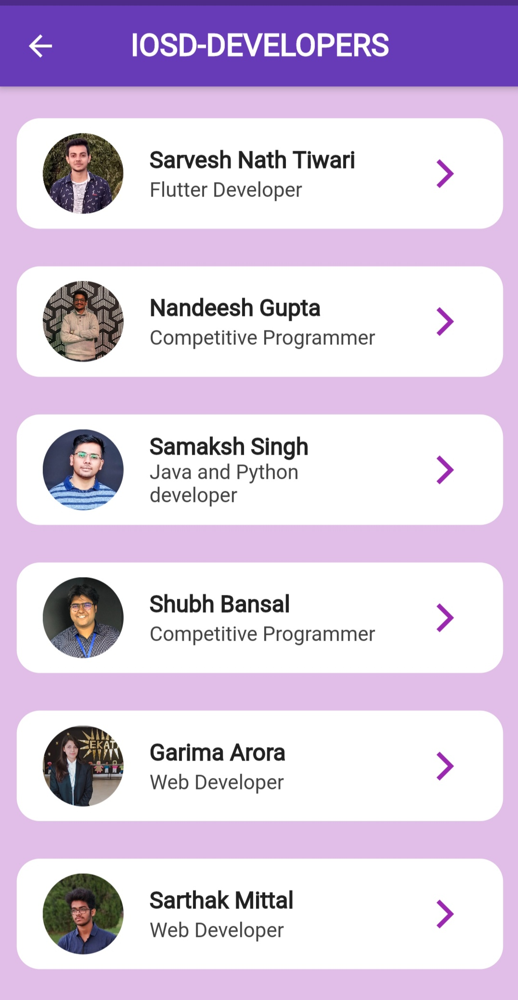

# HacktoberFest 2020

# IOSDMaitApp

- A repository based on flutter framework made for the flutter developers to contribute in this project asa part of Hactoberfest 2020.
- In this repository each contributor will be adding their peice of information(info section) and get hands on experience with creating PRs and learn about brnaching, merging, etc.

## Screenshots

  | Welcome Screen                                                   | Developers Screen                                                 | Developer's Info                                              |
| -------------------------------------------------------------- | ----------------------------------------------------------------------- | -------------------------------------------------------------------- |
|  |  |  |

## Steps for your contribution:

### Step 1: Fork this repository

- A fork would place a copy of this project in your GitHub Account

### Step 2: Clone the repository

- Cloning the repository will place a local copy of project on your own machine
- Copy the URL from the copy to clipboard icon

- Open a terminal and run the following git command :

`git clone https://github.com/<your-user-name>/IOSDMaitApp.git`

### Step 3: Create a branch

- A branch is a way to keep your changes separate from the main part of the project called `Master`. For example if things go wrong and you are not happy with your changes you can simply delete the branch and the main project won't be affected.

Change to the repository directory on your computer (if you are not already there):

`cd IOSDMaitApp`

Now create a branch using the `git checkout` command:

`git checkout -b <your-name-profile-card>`

(While the branch name can be anything we suggest you to keep it the way we mentioned.)

### Step 4: Make necessary changes and commit

1. Open the project in _Android Studio_ or
   _VS Code_. Make sure you are not on _master_ branch.

2. Search for `assets/profilePic` folder and drop your profile picture over there. It would be better if you can keep the name of your image file as
   yourname.fileformat

3. Search for  ` lib/completeMemberInfo.dart `.  Make a copy of the form as the one created above. Comments are added over there to help you get it done. Make use of and modify the file with your details.

| Parameters        |  Info                                        |
| ----------------- | -------------------------------------------- |
| name              | Your Full name                               |
| year              | Your present year of college                 |
| department        | Your branch                                  |
| profilePath       | The path where you stored your profile photo |
| aboutMe           | A brief description about yourself           |
| facebookUrl       | Your Facebook account url                    |
| githubUrl         | Your Github account url                      |
| linkedInUrl       | Your LinkedIn account url                    |
| status            | Write your techincal expertise in 2-3 words  |

---

4. Copy the exact portion of a member object given in the screenshot and paste it. Maintain a gap of 2-3 lines between the profile cards. Indentation should be kept in mind.

5. Check whether your profile has been successfully added in the application or not. Connect your android device and run the application.
   You must have USB Debugging enabled on your phone. Make sure your info is visible under _members_ table.

6. Modify the profile card with your information. If you execute the command `git status`, you'll see there are changes.

7. Add those changes to the branch you just created using the `git add` command:

`git add .`

Now commit those changes using the `git commit` command:

`git commit -m "<your-name> Profile Card Added"`

### Step 5: Push Changes

Push your changes using the command `git push origin <your-branch-name>`

### Step 6: Make a Pull Request

Go to your repository on GitHub, you'll see a `Compare & pull request` button. Click on it.

Now submit the pull request

Congrats! You have made your first contribution! Happy Coding!

---

## Connect with me on LinkedIn

[My LinkedIn Account](https://www.linkedin.com/in/sarvesh-nath-tiwari-5575a218a)

## *Developed and managed by-* ✨

<!-- ALL-CONTRIBUTORS-LIST:START - Do not remove or modify this section -->
<!-- prettier-ignore-start -->
<!-- markdownlint-disable -->

<table>

  <tr>
    <td align="center"><a href="https://github.com/sarveshsrv"> <b>Sarvesh Nath Tiwari</b></a> <a href="https://github.com/sarveshsrv?tab=repositories" title="Code">💻 📖 📆 👀</a></td>
  </tr>
  
</table>
<!-- markdownlint-enable -->
<!-- prettier-ignore-end -->
<!-- ALL-CONTRIBUTORS-LIST:END -->

